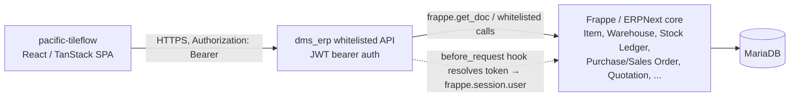
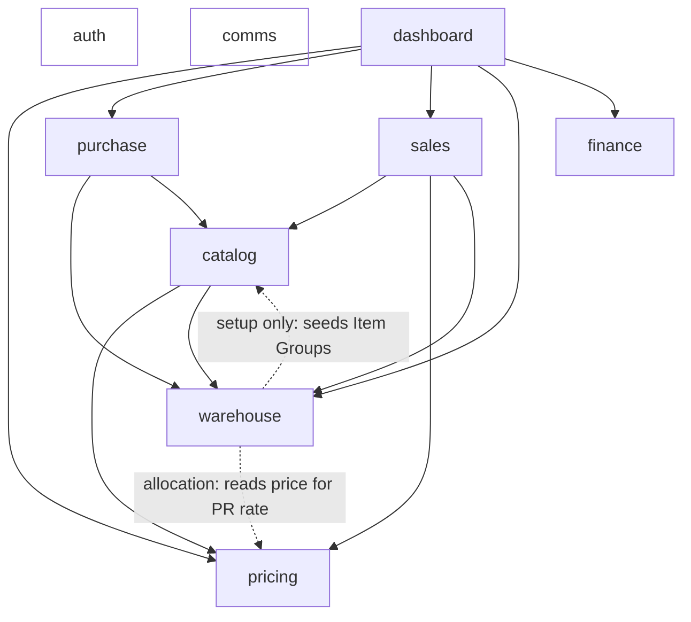
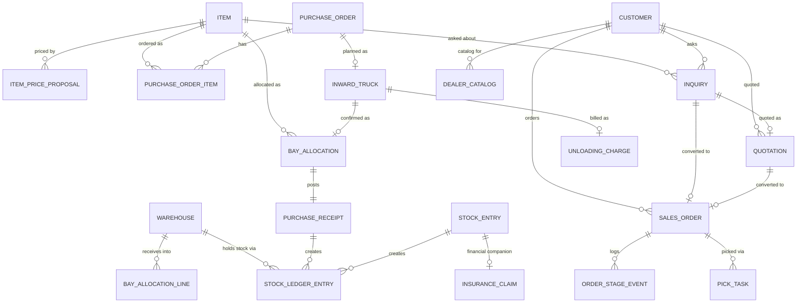
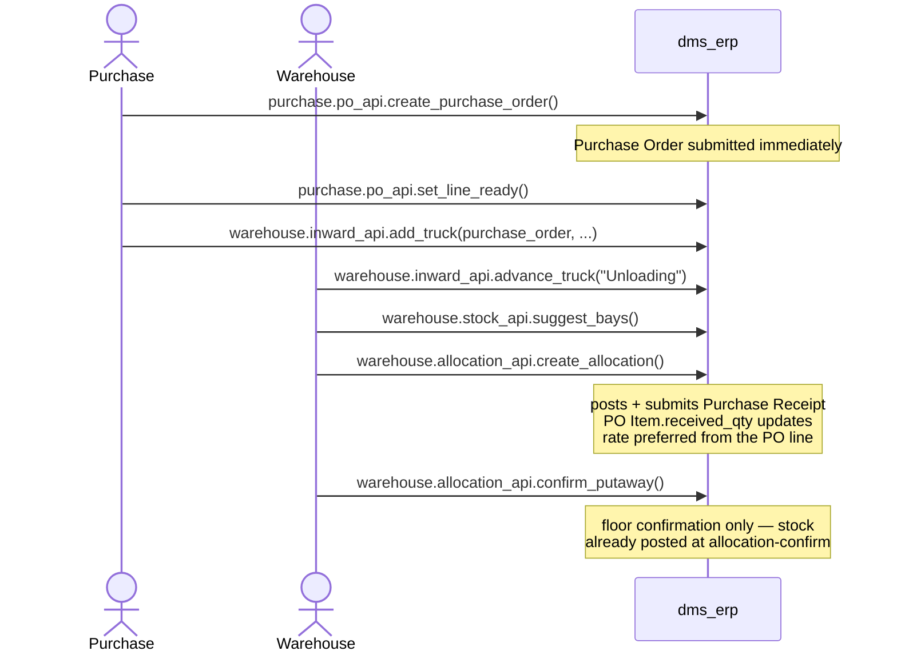
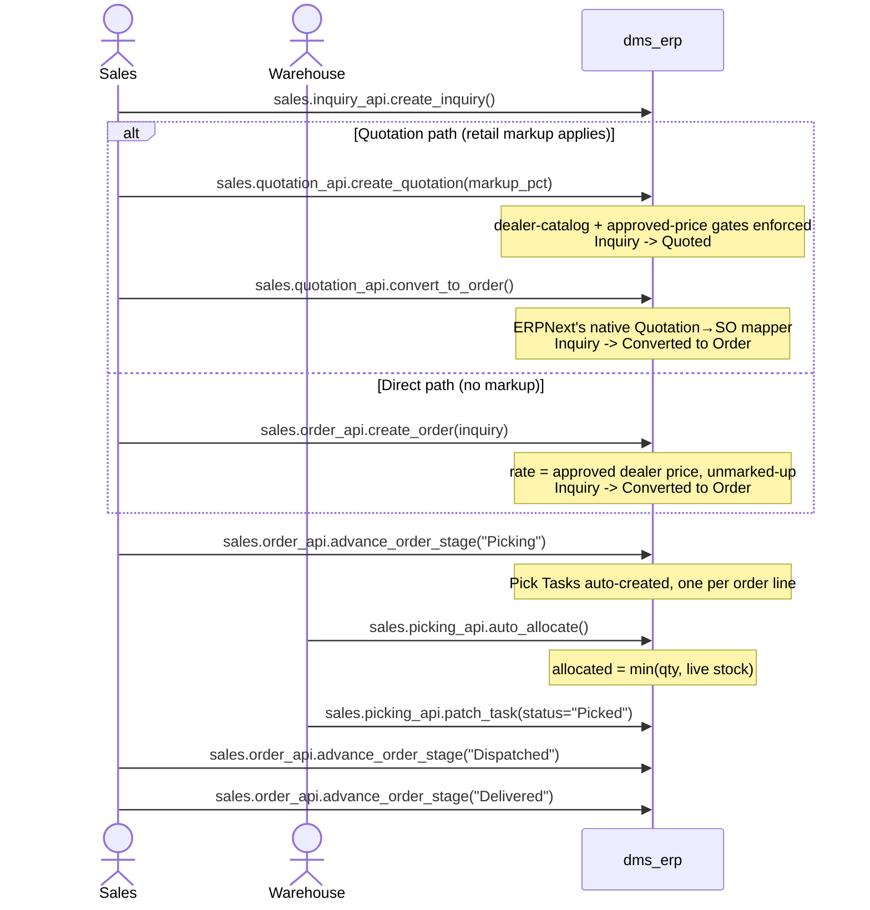
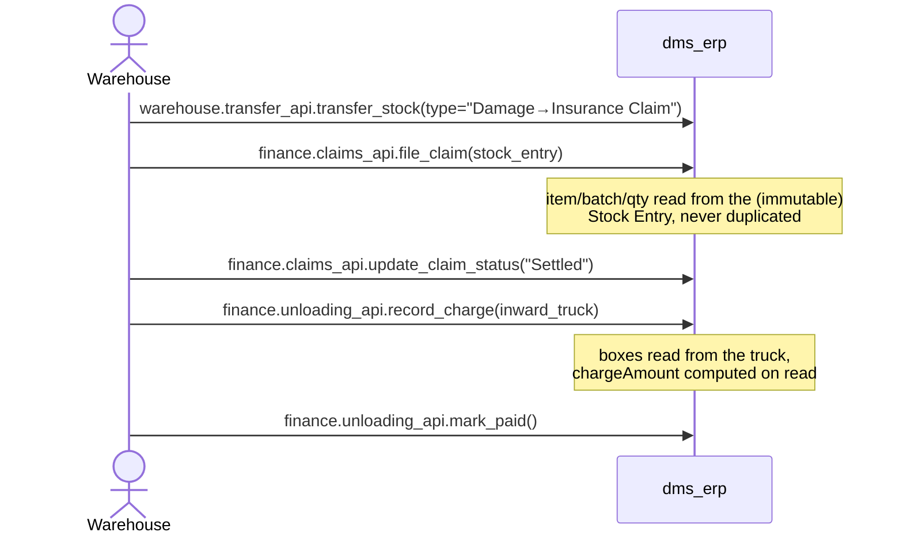

# Pacific DMS — Architecture Blueprint

This is the companion document to `README.md`. `README.md` is the operational
reference — install steps, `site_config.json` keys, and the full endpoint-by-
endpoint API list, updated phase by phase as it was built. This document is the
narrative: how the system is shaped, why it's shaped that way, and what's
deliberately not built yet. Read this first if you're new to the codebase; use
`README.md` and each module's own `README.md` for day-to-day reference.

A shareable, designed version of this exact document is published as
**[Architecture Blueprint](https://claude.ai/code/artifact/50e519a4-a4dc-4633-867c-e58561cca9c2)**
— better for sharing with anyone who won't clone the repo. This file is the
source of truth the published version is generated from; update this one and
republish the artifact, not the other way around. §4 below links out to a
second, earlier artifact, **[Doctype Ledger](https://claude.ai/code/artifact/e4e6e133-3cc2-41da-823e-d3fe4abdaa8b)**,
for the full doctype-by-doctype schema reference and a worked example call
sequence, rather than repeating that detail here.

---

## 1. Overview & purpose

`dms_erp` ("Pacific DMS") is a custom Frappe app installed into an existing
ERPNext site, built for Pacific Inc, a B2B ceramic tile distributor. It backs
an internal staff operations system — warehouse, purchasing, sales, and
finance staff — not the dealers themselves. It's built against a BRD (*Pacific
Inc Business Requirement Document*, MicroNXT v1.0) in eight phases, all now
implemented:

| Phase | Domain | Module |
|---|---|---|
| 0 | Staff auth | `auth` |
| 2 | Product / pricing / dealer catalog | `catalog`, `pricing` |
| 3 | Warehouse / bay / allocation / inward / transfers / stock | `warehouse` |
| 4 | Purchase orders / reorder engine | `purchase` |
| 5 | Inquiries / quotations / orders / picking | `sales` |
| 6 | Damage/insurance claims / unloading payment | `finance` |
| 7 | WhatsApp / communications | `comms` |
| 8 | Dashboards / analytics | `dashboard` |

(There is no "Phase 1" — it was reserved and never scoped.)

The frontend is a separate repo, `pacific-tileflow`, a React/TanStack SPA
already fully built against mock, in-memory data. This app is the real backend
it's meant to be wired to — **that wiring has not happened yet**; see
[§11 Roadmap](#11-roadmap).

**Explicitly out of scope for this app:**
- A separate dealer/customer-facing mobile+web app, with its own OTP+password
  JWT flow. Different product, different auth model, not started.
- Real WhatsApp Business API integration — the BRD places that with external
  middleware; this app is the system of record and a webhook contract only
  (§5).
- Invoicing / accounts receivable — no phase in the plan ever posts a Sales
  Invoice, so anything requiring real AR data is honestly stubbed, not
  estimated (§8).

---

## 2. Architecture

Two tiers: the SPA talks to Frappe purely over whitelisted JSON API methods,
authenticated with JWT bearer tokens issued by this app. Nothing else changes
about how Frappe/ERPNext works underneath.

No cookies, no CSRF, nothing redirects into `/app` — the staff app never
touches Frappe Desk. All four staff roles are created with `desk_access = 0`.

### The one rule that governs almost every decision in this codebase

> **Reuse a native ERPNext doctype where one exists. Extend it with custom
> fields when it's close but not quite. Build a new doctype only when the
> workflow itself has no ERPNext analog.**

This was decided explicitly for two things before Phase 3 (bays map onto
`Warehouse`; new doctypes only where ERPNext has no equivalent) and then
applied consistently, by inference, another ~20 times across the rest of the
build. See the [Doctype Ledger](https://claude.ai/code/artifact/e4e6e133-3cc2-41da-823e-d3fe4abdaa8b)
for the full accounting — as of Phase 8: **7 native doctypes extended** with
custom fields, **9 native doctypes used untouched**, **13 custom doctypes**
(9 standalone + 4 child tables).

The recurring consequence worth naming: the custom doctypes are almost always
a *planning* layer (a session, a slip, a task, a log). The stock- and
document-level event that follows always lands on a native ERPNext document —
Purchase Receipt, Stock Entry, Sales Order, Quotation — so nothing in this app
bypasses ERPNext's own ledger, valuation, or reporting.

### Module dependency graph

Modules depend on each other exactly this much (verified against the actual
Python imports, not aspirational):

`auth`, `pricing`, and `comms` have no dependency on any other `dms_erp`
module. `finance` is Python-decoupled from everything — it references `Stock
Entry` and `Inward Truck` only by doctype name string, never by importing
`warehouse`'s code — even though it's conceptually a Phase 3 companion.
`catalog` and `warehouse` depend on each other in different senses (`catalog`
reads live stock at runtime; `warehouse` only reads `catalog`'s Item Group
list once, at install time) — a two-way coupling, called out here rather than
left implicit.

---

## 3. Security model

- **Transport**: JWT bearer tokens, not Frappe's cookie session. A
  `before_request` hook (`auth/middleware.py`) resolves `Authorization: Bearer
  <token>` to `frappe.session.user` for that request only.
- **Access tokens**: short-lived (default 40 min), stateless-verified, but
  still checked against the issuing `Auth Session` doctype's `revoked_at` so
  `logout`/`logout_all` take effect immediately rather than waiting for
  expiry.
- **Refresh tokens**: opaque random strings (never JWTs), only their SHA-256
  hash is stored. Every `refresh_token` call rotates the token; presenting a
  token that was already rotated out is treated as compromise and revokes the
  session outright.
- **Signing keys**: rotatable via a `{kid: secret}` map in `site_config.json`,
  never auto-generated.
- **Roles**: four Frappe Roles (`Pacific Sales` / `Warehouse` / `Purchase` /
  `Management`), all `desk_access = 0`, created on install/migrate. `System
  Manager` is always an accepted escape hatch. Every write-capable endpoint
  across every module does its own role check in Python (`_assert_can_*`
  helpers) in addition to whatever doctype-level permissions exist — the API
  layer is the real security boundary, not Desk permissions, since these
  users never see Desk.
- **The one external caller**: the (not-yet-built) WhatsApp middleware calls
  two `allow_guest` webhook endpoints, gated by a shared secret in
  `site_config.json` — explicitly a placeholder, not a real verification
  scheme (no spec exists yet for what the real middleware will use).

---

## 4. Data model

Full doctype-by-doctype detail — every custom doctype, every custom field,
and the one-line reason for each — lives in the published
**[Doctype Ledger](https://claude.ai/code/artifact/e4e6e133-3cc2-41da-823e-d3fe4abdaa8b)**
rather than duplicated here. The summary:

- **Custom doctypes (13, 9 standalone + 4 child tables)**: Auth Session, Item
  Price Proposal (+ History child), Dealer Catalog (+ Item child), Inward
  Truck, Bay Allocation (+ Line child), Inquiry, Order Stage Event (child),
  Pick Task, Insurance Claim, Unloading Charge.
- **Native doctypes extended with custom fields (7)**: Item, Warehouse, Stock
  Entry, Purchase Order, Purchase Order Item, Quotation, Sales Order.
- **Native doctypes used exactly as shipped (9)**: Item Group, Item Price,
  Price List, Item Alternative, Customer, Bin, Stock Ledger Entry, Batch,
  Purchase Receipt.

### How the core documents reference each other

Two relationships worth calling out because they're not obvious from field
names alone: `Bay Allocation` doesn't move stock itself — confirming one
*posts and submits* a Purchase Receipt, and that's the actual stock-ledger
event. Likewise `Stock Entry` (a bay-to-bay transfer) is what a damage
transfer *is*; `Insurance Claim` is a thin financial record hung off it by
reference, not a separate movement.

---

## 5. Integration points

### Frontend ↔ backend

Every module exposes its API under `/api/method/dms_erp.<module>.<file>.<method>`.
The full endpoint list, with auth requirements and notes, is in `README.md`
(one section per phase) and each module's own `README.md`. Response shapes
match the frontend's TypeScript types field-for-field (camelCase) wherever a
type already existed; where it didn't (Phase 5's Inquiry mutations, all of
Phase 8), this app defines the shape the frontend will need to adopt.

### ERPNext modules this app builds on

Stock (Warehouse, Bin, Stock Ledger Entry, Batch, Stock Entry, Purchase
Receipt), Buying (Purchase Order), Selling (Quotation, Sales Order), and core
(Item, Item Group, Item Price, Price List, Customer, Supplier, User, Role).
Notably **not** Accounts — no Journal Entry, Payment Entry, or Sales Invoice
is ever posted by this app (§8).

### External systems

- **WhatsApp middleware** (not yet built): `comms/api.py` exposes
  `webhook_inbound_message` and `webhook_status_update` as the contract that
  middleware is expected to call. This app never calls a WhatsApp API itself.
- **Future dealer-facing app** (not yet built, separate project): will need
  its own OTP+JWT auth distinct from this app's staff auth, and will likely
  read the same `catalog`/`pricing`/`sales` data this app already exposes —
  worth designing that read path deliberately when that project starts,
  rather than granting it staff credentials.

---

## 6. Business process flows

### Procure → receive → stock (Phases 2–4)

### Demand → dispatch (Phase 5)

### Exceptions: damage claim & unloading pay (Phases 3 & 6)

---

## 7. Module reference

| Module | Doctypes it owns | Write role | Read role |
|---|---|---|---|
| `auth` | Auth Session | — (self-service) | authenticated caller |
| `catalog` | Dealer Catalog (+ item child) | Purchase, Management | everyone |
| `pricing` | Item Price Proposal (+ history child) | Purchase, Management | everyone |
| `warehouse` | Inward Truck, Bay Allocation (+ line child) | Warehouse, Management (+Purchase for trucks) | everyone |
| `purchase` | — (native PO only) | Purchase, Management | everyone |
| `sales` | Inquiry, Order Stage Event (child), Pick Task | Sales/Management (Warehouse for Pick Task) | everyone |
| `finance` | Insurance Claim, Unloading Charge | Warehouse, Management | everyone |
| `comms` | WhatsApp Message | Sales, Management (+ webhook secret) | everyone |
| `dashboard` | — (read-only) | — | own role + Management |

("Everyone" always means the four staff roles collectively; `dashboard` is
the one module where even reads are role-partitioned, since each dashboard is
role-specific by design.)

---

## 8. Known gaps & deferred scope

Collected here from the "Phase N additions" notes scattered through
`README.md`, so the gaps are findable in one place rather than only ever
surfacing in a PR description:

- **No accounts-receivable ledger.** No phase ever posts a Sales Invoice or
  Payment Entry. `dashboard.management_dashboard`'s `outstandingReceivables`
  is a hard `0`; its credit-limit alert compares `Customer.credit_limit`
  against Sales Order value, not true outstanding receivables.
- **No General Ledger postings for claims or unloading pay.** Both are
  tracked as real records (status, amounts, dates) but never become a
  Journal Entry or Payment Entry — that needs Chart-of-Accounts accounts this
  app can't assume exist on an arbitrary target site.
- **Reorder engine's demand signals are still stubbed at 0** —
  `missedDemandQty`, `pendingInquiryQty`, `recentRetailSalesQty` in
  `purchase.reorder_api` — even though Phase 5 now has real Inquiry/Order data
  that could feed them. Flagged in Phase 4's own docstring as the thing to
  wire up next; not done automatically when Phase 5 landed.
- **`Product.lastSoldDays` is still stubbed at `0`** in `catalog.api`, with a
  comment pointing at "Phase 5" — which now exists and could supply it (last
  Sales Order date per item) but hasn't been wired back in, the same class of
  gap as the reorder engine above.
- **Picking doesn't move stock.** `auto_allocate`/`patch_task` are
  reservation bookkeeping; no Delivery Note is created, Bin/Stock Ledger
  Entry are untouched by picking or dispatch.
- **WhatsApp is a system of record only** — no real WhatsApp Business API
  call happens anywhere; `comms` waits on external middleware that doesn't
  exist yet.
- **Dealer/Customer master fields are minimal.** Catalog visibility links to
  `Customer` by name; Pacific-specific dealer attributes (salesperson
  assignment beyond native Sales Team, Retail/Project/Sub-dealer type) were
  never added since no phase's UI reads them yet.
- **`Product.bay` stays a placeholder `"—"`.** A real item can be split
  across several bays; the frontend's flat `Product.bay` field can't
  represent that. The real per-bay breakdown is `warehouse.stock_api.list_stock`.
- **Quotation freight is a plain field**, not wired into ERPNext's native
  Sales Taxes and Charges (same Chart-of-Accounts problem as above).
- **The frontend has not been wired to this backend at all.** Every phase
  was built by reading the frontend's existing TypeScript types and mock
  stores, matching field names precisely, but `pacific-tileflow` still reads
  from its own in-memory mocks. See [§11](#11-roadmap).

---

## 9. Environment & setup assumptions

Documented in full in `README.md`'s "Assumptions made" sections (one per
phase); the load-bearing ones:

- **Frappe/ERPNext version**: targets a recent v15-line site (`pyproject.toml`
  app layout). Not verified against any other version — this container never
  had `bench` available to test against a real site.
- **Environment**: plain `bench` (local or `frappe_docker`), not Frappe Cloud.
- **App identity**: `dms_erp` / "Pacific DMS", derived from the repo name
  `DmsErpService`.
- **Required `site_config.json` keys**: `dms_erp_jwt_keys` +
  `dms_erp_jwt_active_kid` (Phase 0, no default — install fails safe rather
  than mint a throwaway secret), `dms_erp_whatsapp_webhook_secret` (Phase 7,
  same reasoning).
- **Install-time dependency**: a default Company must exist before
  `warehouse.setup.setup_warehouse` can create the two physical warehouses —
  if none exists yet at install/migrate time, it logs a warning and skips
  rather than failing the whole migration.
- **`erpnext` is a required app** from Phase 2 onward (`hooks.py`
  `required_apps`) — catalog/pricing/warehouse/purchase/sales all build
  directly on ERPNext's Selling/Buying/Stock doctypes.

---

## 10. Testing approach

Every module has its own `test_*.py` files using `FrappeTestCase`. Shared
fixtures (`ensure_company`, `make_item`, `make_supplier`, `make_dealer`,
`make_bay`) live in `warehouse/test_fixtures.py` and are imported by every
other module's tests rather than re-implemented per module — a `Warehouse`
had to exist for Phase 3 anyway, and every phase since has needed a priced
Item and a company, so it became the natural shared home rather than
duplicating three lines of setup nine times.

**Real limitation, stated plainly**: this container never had `bench`,
MariaDB, or a live Frappe site available. Every test file has been verified
by `python3 -m py_compile` and every doctype JSON by `json.load` — syntactic
correctness, not runtime correctness. No test in this repo has actually been
*executed* yet. Running `bench run-tests --app dms_erp` against a real site is
the first thing worth doing before trusting this code in anger.

---

## 11. Roadmap

**Immediate, and arguably overdue**: wire `pacific-tileflow` to this backend.
Every phase was built by reading the frontend's mock stores and matching
their shapes, specifically so this step would be mechanical — but it hasn't
been started. Auth is the obvious first slice (replace `lib/auth.ts`'s
`signIn(email)` with real `login`/`refresh_token` calls and a token store).

**Near-term, closing this app's own known gaps** (§8): wire the reorder
engine and `lastSoldDays` to Phase 5's real data now that it exists; consider
whether picking should create a real Delivery Note.

**Larger, not yet scoped**: an invoicing/AR phase (would unlock real
receivables and GL posting for claims/unloading pay), the real WhatsApp
Business API integration behind the webhook contract already built, and the
separate dealer-facing app with its own OTP+JWT auth.
